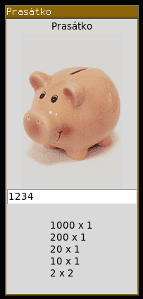

PRG -- Prasátko GUI
=============================

Vytvořte **grafickou** aplikaci, která simuluje výběr peněz z vašeho prasátka.
V textovém souboru `umbilikus.txt` je uložen aktuální počet jednotlivých
bankovek/mincí v prasátku. Uživatel zadá částku, kterou chce vybrat, prasátko
mu ji vysype (na obrazovce se vypíše počet jednotlivých bankovek/mincí) a
aktualizuje si stav úspor. Pokud danou částku nemá k dispozici nic nevysype,
ale místo toho napíše chybové hlášení.

Vypořádejte se korektně i se stavem, kdy určité mince/bankovky dojdou a budete
je muse nahradit jinou mincí/bankovkou nižší hodnoty.

